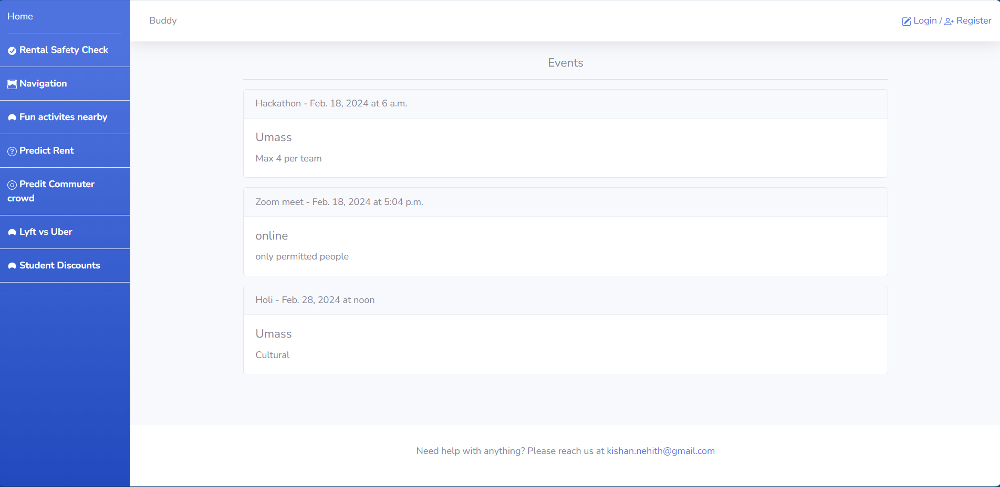
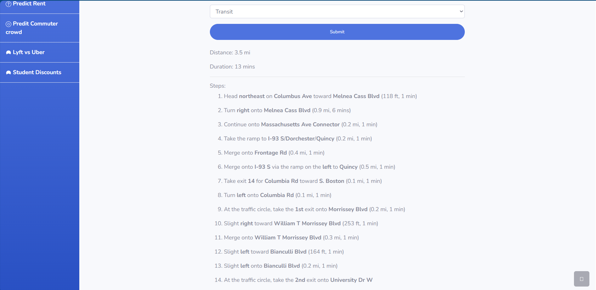
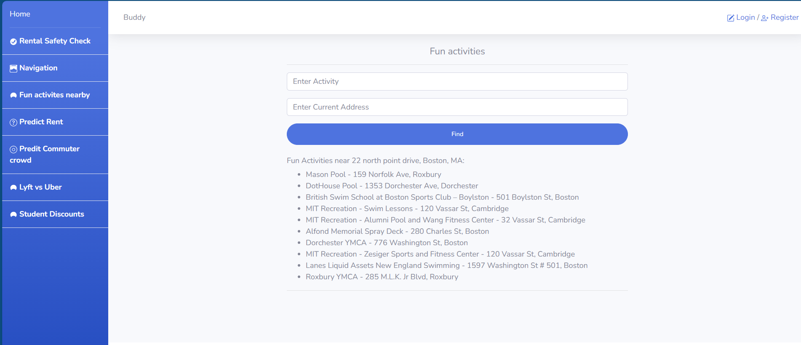
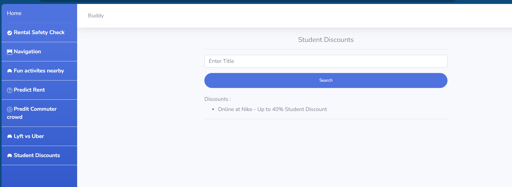

# BOSTON BRIDGE HACKATHON
## Team: BUDDY

## Team members:
	kyshan Neheeth
	Srikar kodavati
    Sruthi Damera
    Vivek Kamisetty
 
## Project Description
    This is a friend who will help you with every stage of your student life,
    from helping you settle down to helping you find fun activity places and other
    directions to guide you through Boston.

## Technologies Used
    Python, Django, HTML, CSS, Bootstrap, Javascript, Random forest model, Scikit-learn

## Installation instructions
	git clone https://github.com/KyshanNeheeth-Peruru/Boston_Bridge_Hackathon.git

## Windows -
    python -m benv venv
    .\benv\Scripts\activate
    pip install -r requirements.txt

## Mac or Linux
	python3 -m benv venv
    source benv/bin/activate
	pip3 install -r requirements.txt

## Link to model file
This file should be placed in ml_models directory.
#### ride_price.joblib file
	https://drive.google.com/file/d/1ZncxYIiIAJCoDwhDLOUx4CcFgeBnSoUw/view?usp=sharing

## Usage Instructions
- An admin can enter events into the database and display these events on the home page.
- Users can enter any address and check the violations that have occurred in the house.
- Users can enter a source, destination, and select a type of transit to get distance, duration, and steps to follow in order to reach the destination.
- Users can enter an activity and their current address to find out where they can go to engage in that activity.
- Users can enter any address, number of rooms, number of baths, and choose the type of house to predict the rent of the house.
- Users can select an area, enter a date and time to predict the crowd that may travel during that commute.
- Users can view the student discounts provided by a particular brand in Boston by entering the name of the brand.

## Screenshots

## Demo Video

Find the demo video in base directory

<video controls src="Home and 22 more pages - Personal - Microsoft​ Edge 2024-02-18 18-51-17.mp4" title="Title"></video>

